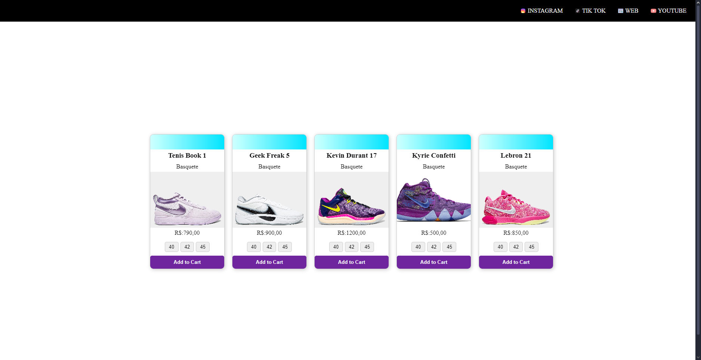

---
##sobre 

Projeto de Interface Interativa para Loja de Tênis – SENAI Jandira

Este projeto tem como objetivo desenvolver uma interface interativa para uma loja de tênis, proporcionando uma experiência dinâmica e envolvente para os usuários. A aplicação foi criada utilizando HTML, CSS e JavaScript, garantindo efeitos visuais modernos e uma navegação intuitiva.

## Tecnologias utilizadas
- HTML
- CSS
- JS

## Autor
- [Kauan Rodrigues](https://github.com/kauanmlk9860)